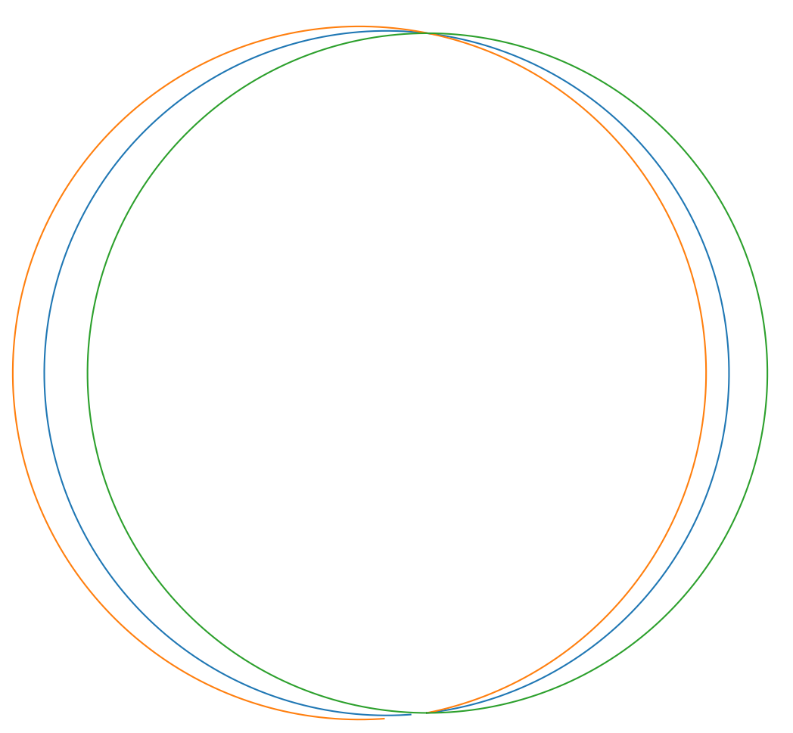
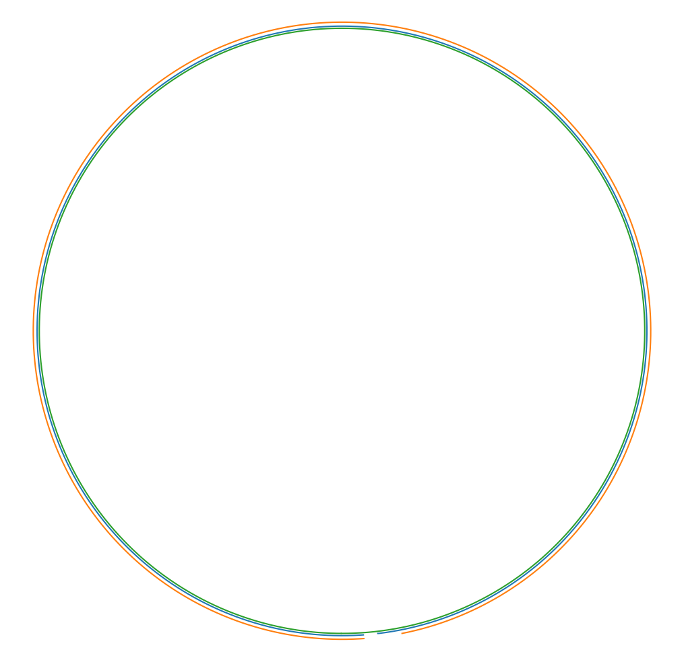
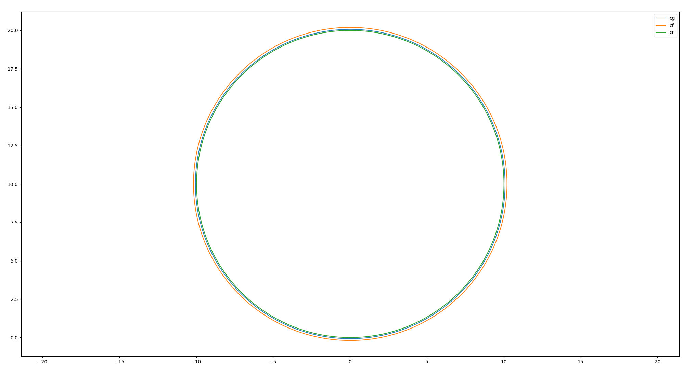
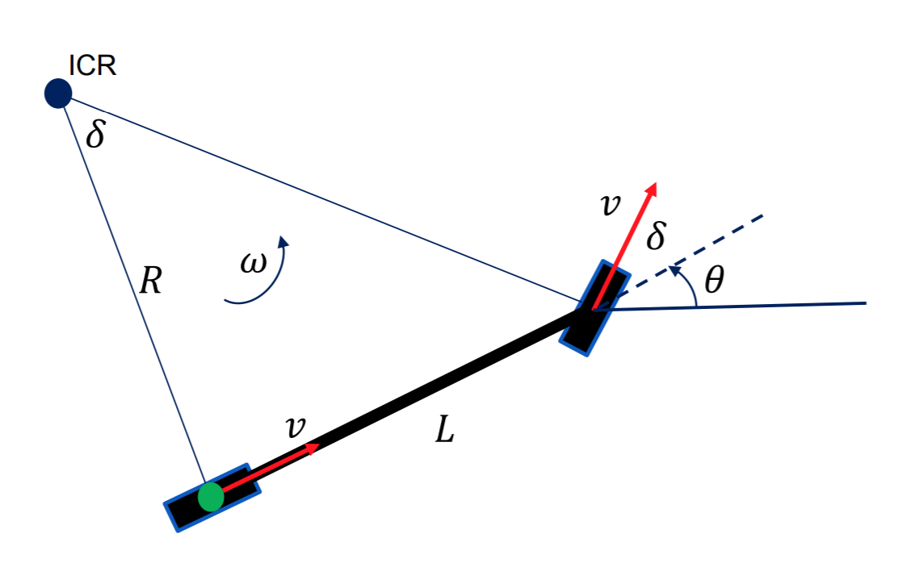
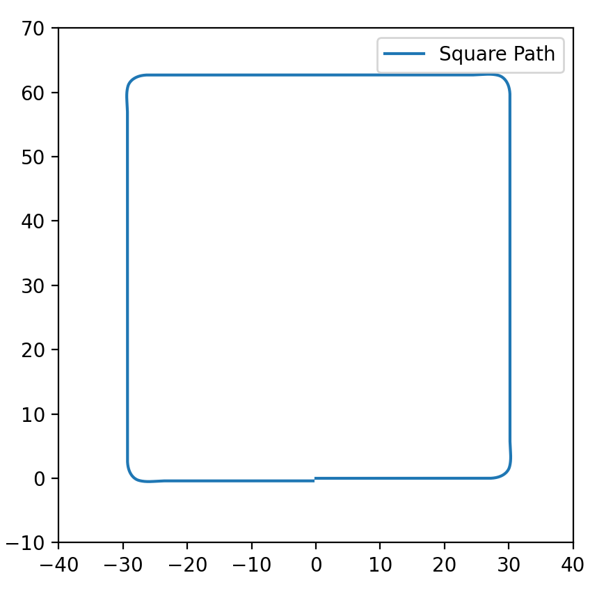
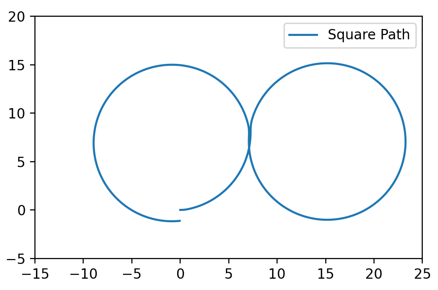

# 总结

## 1.坐标变换

在做坐标变换时一定要格外的小心坐标系问题：
$$
P_{B} = R_{WB} P_{W} + t_{WB} 
$$

> 要格外注意$R_{WB} P_B$. 对应的验证代码为：rotation_matrix.py

##  2. 自行车模型实验结果

课程作业文件：`/homework/Kinematic_Bicycle_Model.ipynb`

**(1) 圆形轨迹实验结果**：`kinematic_bicycle_model_circle.py`

如果按照课程中的思路，分别采用前轮中心、后轮中心和重心来建模，得到的结果如下。

这似乎与我们想象的不太一样，怎么会是三个不同心的圆呢？

其实这里的主要的问题是，课程中给出的代码所有起点都是在$[0,0]$，这一点是导致得到这个实验结果的最主要原因。实际上假设后轮在起点处，实际上重心应该在起点偏右的方向，前轮中心的位置最靠右。

于是，当我修正起点的位置之后，得到的实验结果如下：

目前看起来已经正常很多了，但是还有一个问题，最外面的那个轨迹圆没有闭合。经过分析主要的原因是前轴运动的圆半径大于重心，大于后轴运行轨迹。但是课程中给出的代码是根据后轴中心来计算的半径。当我分别根据对应的模型计算其半径之后，由于半径不一样，他们要想形成一个完整的圆，那么速度就必然要不一样。
$$
R_r = \frac{L}{\tan \delta} \\
R_c = \frac{\frac{L}{\tan \delta}}{\cos \beta} \\
R_f = \frac{L}{\sin \delta}
$$
那么，在同样时间走完一整圈分别对应的速度如下：
$$
v = \frac{2\pi R}{t}
$$
对代码进行修正之后的结果如下：

注意：在课程中出现的Simple Car模型示意图（如下图）有一定的误导性，实际上前轴、重心、后轴在转向的时候速度是不一样的！

**(2) 方形轨迹实验结果**：`kinematic_bicycle_model_square.py`

**(3) 8字轨迹实验结果**：`kinematic_bicycle_model_eight.py`

> 可以看到(2)、(3)的结果都不是一个严格的封闭图形，其中最重要的原因是转向角不能突变！

## 3.车辆动力学实验结果

课程作业文件：`/homework/Longitudinal_Vehicle_Model.ipynb`

