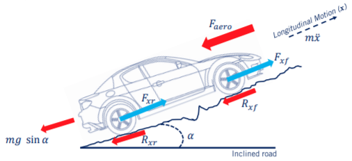
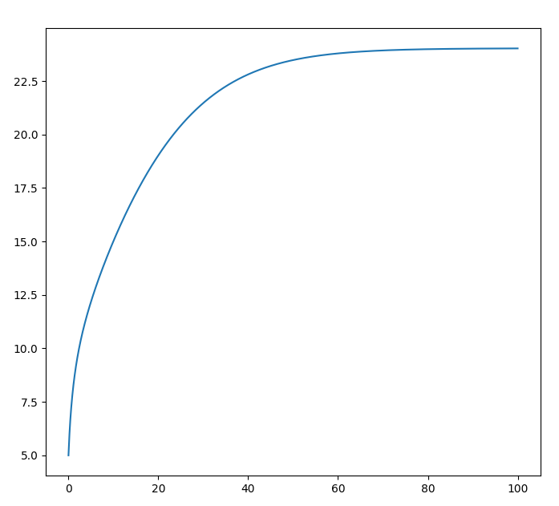
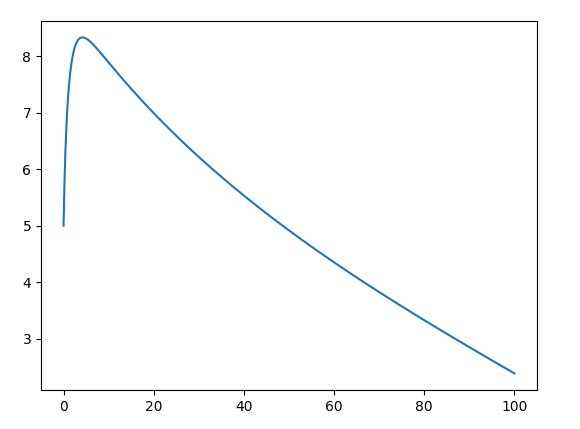

# 总结

## 1.坐标变换

在做坐标变换时一定要格外的小心坐标系问题：
$$
P_{B} = R_{WB} P_{W} + t_{WB} 
$$

> 要格外注意$R_{WB} P_B$. 对应的验证代码为：rotation_matrix.py

##  2. 自行车模型实验结果

课程作业文件：`/homework/Kinematic_Bicycle_Model.ipynb`

[课程作业源地址](https://www.coursera.org/learn/intro-self-driving-cars/ungradedLab/RL3rX/module-4-programming-exercise-kinematic-bicycle-model/lab?path=%2Fnotebooks%2FCourse_1_Module_4%2FKinematic_Bicycle_Model.ipynb)

**(1) 圆形轨迹实验结果**：`kinematic_bicycle_model_circle.py`

如果按照课程中的思路，分别采用前轮中心、后轮中心和重心来建模，得到的结果如下。

这似乎与我们想象的不太一样，怎么会是三个不同心的圆呢？

其实这里的主要的问题是，课程中给出的代码所有起点都是在$[0,0]$，这一点是导致得到这个实验结果的最主要原因。实际上假设后轮在起点处，实际上重心应该在起点偏右的方向，前轮中心的位置最靠右。

于是，当我修正起点的位置之后，得到的实验结果如下：

目前看起来已经正常很多了，但是还有一个问题，最外面的那个轨迹圆没有闭合。经过分析主要的原因是前轴运动的圆半径大于重心，大于后轴运行轨迹。但是课程中给出的代码是根据后轴中心来计算的半径。当我分别根据对应的模型计算其半径之后，由于半径不一样，他们要想形成一个完整的圆，那么速度就必然要不一样。
$$
R_r = \frac{L}{\tan \delta} \\
R_c = \frac{\frac{L}{\tan \delta}}{\cos \beta} \\
R_f = \frac{L}{\sin \delta}
$$
那么，在同样时间走完一整圈分别对应的速度如下：
$$
v = \frac{2\pi R}{t}
$$
对代码进行修正之后的结果如下：

注意：在课程中出现的Simple Car模型示意图（如下图）有一定的误导性，实际上前轴、重心、后轴在转向的时候速度是不一样的！

**(2) 方形轨迹实验结果**：`kinematic_bicycle_model_square.py`

**(3) 8字轨迹实验结果**：`kinematic_bicycle_model_eight.py`

> 可以看到(2)、(3)的结果都不是一个严格的封闭图形，其中最重要的原因是转向角不能突变！

## 3.车辆动力学实验结果

课程作业文件：`/homework/Longitudinal_Vehicle_Model.ipynb`

[课程作业源地址](https://www.coursera.org/learn/intro-self-driving-cars/ungradedLab/ASRqa/module-4-programming-exercise-longitudinal-vehicle-model/lab?path=%2Fnotebooks%2FCourse_1_Module_4%2FLongitudinal_Vehicle_Model.ipynb)

**(1)长轴动力学建模推导**

在考虑了路面坡度之后，汽车在长轴方向上总的受力如下式：
$$
m\ddot x  = F_{xf} + F_{xr} - F_{aero} -R_{xf} - R_{xr} -mg \sin \alpha
$$
将前轮和后轮的动力总和记作$F_x$
$$
F_x = F_{xf} + F_{xr}
$$
将前轮和后轮的阻力总和记作$R_x$
$$
R_x = R_{xf} + R_{xr}
$$
则最终可以简化为：
$$
m\ddot x = F_x - F_{aero} -R_x - mg \sin \alpha
$$
其中，也将所有阻力叫做加载力，记作：
$$
F_{load} = F_{aero} + R_x + mg \sin \alpha
$$
对于空气阻力$F_{aero}$的建模，可以使用下式：
$$
F_{aero} = \frac{1}{2}C_a \rho A \dot x^2 = c_a \dot x^2
$$
而轮胎的阻力$R_x$使用下面的模型：
$$
R_x = N( \hat c_{r,0} + \hat c_{r,0}\abs{\dot x} + \hat c_{r,0} \dot x^2) \approx \hat c_{r,1}\abs{\dot x}
$$
对于发动机的扭矩计算如下：
$$
J_e \dot \omega_e = T_e - (GR)(r_{eff}F_{load})
$$
其中，$T_e$是发动机的扭力，$GR$是发动机的转速比，$r_{eff}$是齿轮的有效半径

发动机的扭矩可以简化为如下模型：
$$
T_e = x_{\theta} (a_0 + a_1 \omega_e + a_2 \omega_e^2)
$$
$x_{\theta}$是油门的比例(0~1)

------

在引入发动机以及传动装置之后，系统的转速模型如下：
$$
\omega_{w} = GR\omega_e
$$
其中：$\omega_{w}$是轮子的转速，$\omega_e$是发动机的转速

汽车的动力$F_x$，可以使用下面的模型进行计算：
$$
F_x = 
\begin{cases}
cs  & \abs{s} <1 \\
F_{max} & otherwise
\end{cases}
$$
其中：$s= \frac{\omega_w r_{eff} -\dot x}{\dot x}$，用来表示滑移率

**实验结果：**

通过实验可以看出来，即使在平地上，当速度增加到一定程度之后，将不能在增加，其主要原因是风阻和轮胎的阻力都与速度有关，随之增大。

当增加坡面的倾角之后，由于模型自身的问题，将导致算法失效，会出现发动机的动力小于所有阻力，主要原因是车轮出现了打滑的情况。得到如下的效果图：

