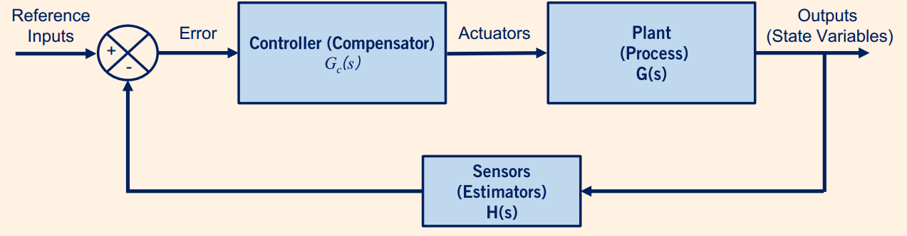
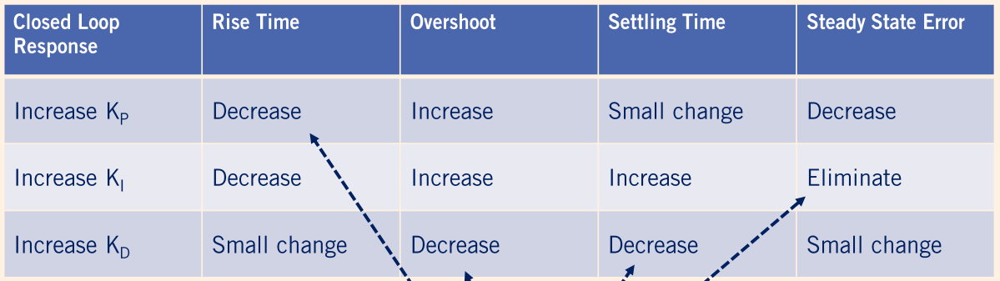
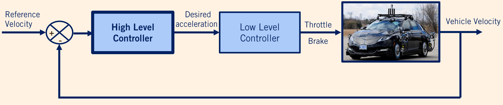

# Vehicle Longitudinal Control Summary

在这一周的课程中，主要介绍了PID控制、PID对纵向运动控制、以及前馈控制和反馈控制组成的控制系统。

## 第一节

**反馈系统**

在第一节中，课程介绍了反馈控制系统，其系统框图如下：

其中，`Controller`所对的框框代表的是控制器，也叫补偿器，它可以PID或者LQR等等，它计算出要输入到待控制系统中的控制量。而`Plant`所代表的是将要控制的系统的模型。如果要控制的是质量块-弹簧-阻尼系统，那么它的系统建模就放在`Plant`中。

**PID控制器**
$$
u(t) = K_{P}e(t) + K_I \int_0^t{e(t)dt} + K_D \dot e(t)
$$
PID控制的建模如上式，分别对应`比例`、`积分`、`微分`。

对上式进行拉普拉斯变换之后，得到复数域的表达：
$$
U(t) = G_C(s)E(s) = (K_P + \frac{K_I}{s} + K_Ds)E(s)
$$
分子的根代表了系统的零点，因此PID系统有两个零点。分母的零点代表了系统的极点，因此PID有一个极点。

PID控制器的增益对系统的影响如上表。

## 第二节

这这一节中，主要介绍了PID对于纵向运动的控制，也就是巡航的时候。

巡航控制的时候，主要是控制车辆的`油门`和`制动器`。

对于巡航而言，它的控制系统如上图，包括高级控制器和低级控制器。高级控制器主要用来将误差转换为要输出的控制量，例如上图是将速度误差转化为加速度补偿，然后输入给低级控制器。低级控制器根据车辆的动力和传动模型，将加速度转化为最终的油门以及制动器来完成对车辆的控制。

 为了简化问题，在课程中低级控制器不考虑刹车，并且不考虑变速器的损失，忽略滑移，认为运动是平滑的。

当低级控制器得到了车辆期望的加速度之后，它将根据车辆的动力学模型计算出期望的扭矩以及发动机转速，`最后通过查表得到期望的油门大小`