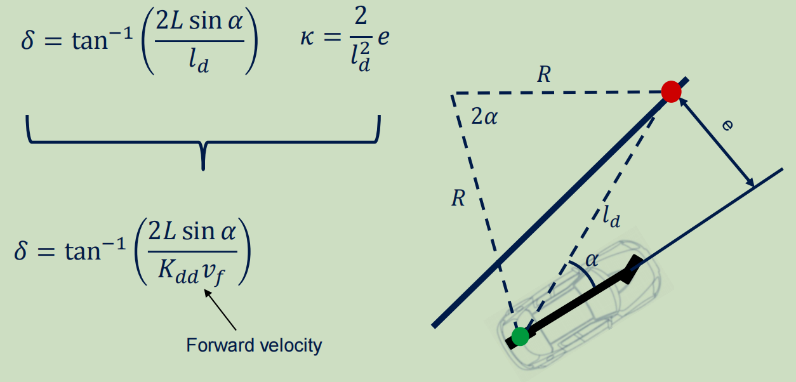
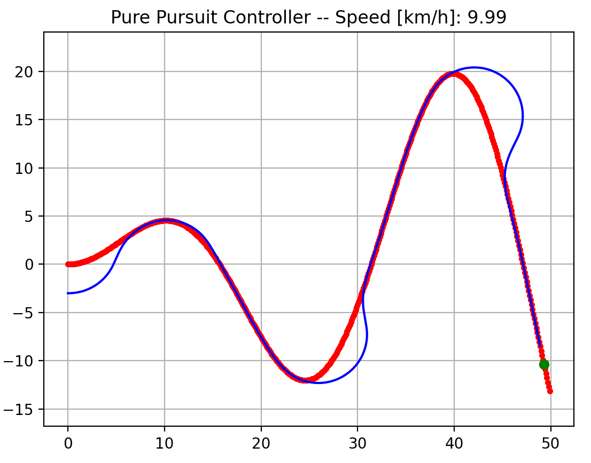
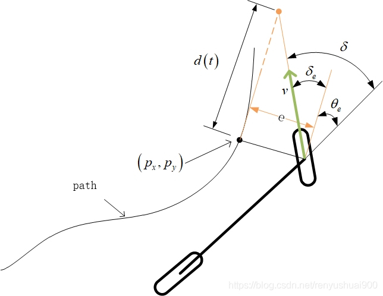
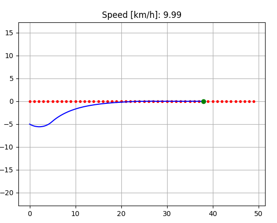
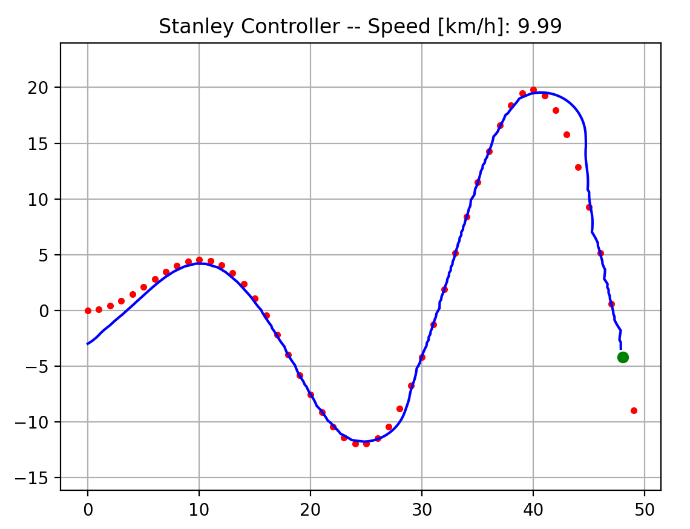
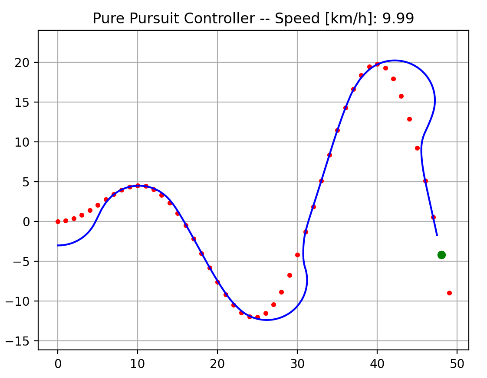
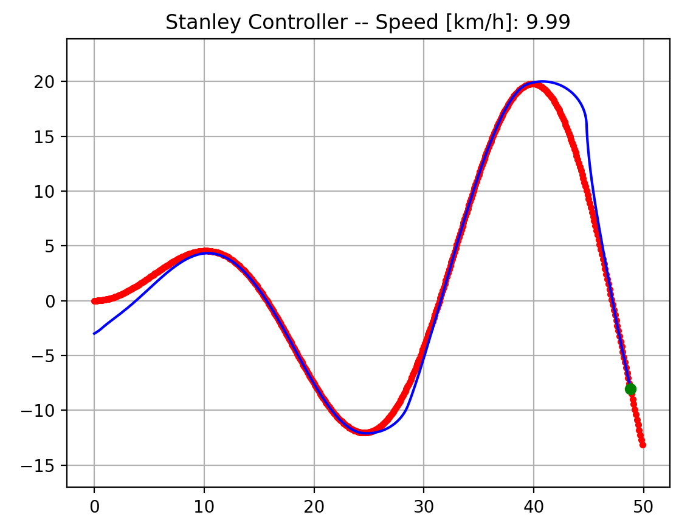
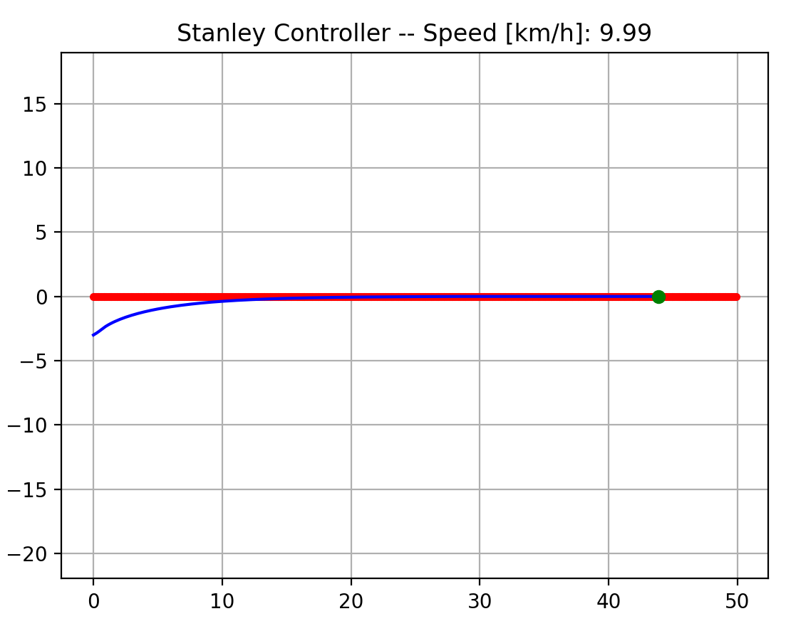
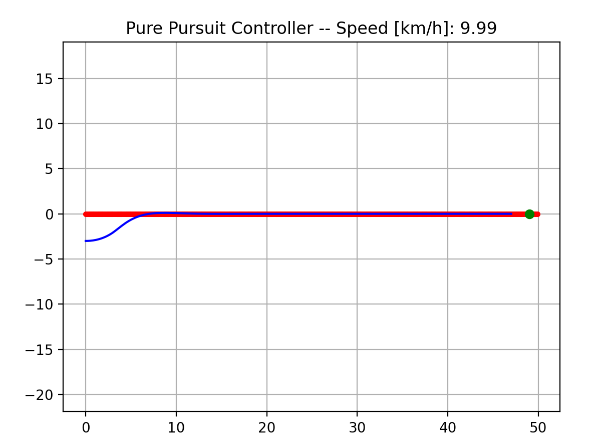

# 总结

## 1. Pure pursuit Controller

纯跟踪控制器的原理比较简单，主要是思路就是汽车始终朝着前看，去追踪汽车前方的一个目标点。

对于纯跟踪控制器，它的主要公式如上图。其中对于$\alpha$角的计算，以红点到绿点的朝向角减去当前车辆的朝向角加上红点。

**代码实现：**`pure_pursuit_control`

**纯跟踪实验结果如下：**

## 2. Stanley Controller

Stanley Controller主要是用来进行lateral control（侧向）控制，它是一个原理简单并且收敛的控制器。

Stanley Controller的误差由两部分组成，一部分是偏航角误差，另一部分横向的偏移误差。

首先，忽略偏移误差，来看偏航角度误差。车辆的航角与轨迹的切线方向的夹角为$\theta_e$，当车辆完全与参考轨迹的方向一致时：$\theta_e = 0$。并且此时车辆的转向角也为0，也就是：
$$
\delta_{\theta_e}(t) = \theta_e(t)
$$
当我们不考虑航向角误差的时候，只考虑车辆的偏移误差。可以预见的是，当偏移误差越大的时候，前轮的转向角也将越大。假设车辆预期轨迹在距离前轮$d(t)$处与给定路径上最近点切线相交，根据几何关系得出如下非线性比例函数：
$$
\delta_e(t) = \arctan \frac{e(t)}{d(t)} = \arctan \frac{ke(t)}{v(t)}
$$
我们可以想象，当车速很大的时候，前轮的转向角此时就不能太大，那么$d(t)$就会变大。因此将$d(t)$成车速$v(t)$和增益$k$的关系。

根据上图中的角度关系可以得到：
$$
\delta(t) = \delta_e(t) + \delta_{\theta_e}(t)
$$
将前面的式子，带入到上式，最终可以得到转向角的控制如下：
$$
\delta(t) = \theta_e(t) + \arctan \frac{ke(t)}{v(t)}
$$
其中，$e(t)$是当前位置到最近参考点的距离；$\theta_e(t)$是车辆航向角与轨迹的切线方向的夹角，可以很容易计算出来。

根据上面的过程，可以非常容易地得到车辆的转向角的控制量。而对于车速的控制，则可以借助别的控制器，例如PID。

> **注意：**对于Stanley控制器，其中的误差$e(t)$的计算需要使用`cross strack error`，这里的距离是有正负之分的。

**代码实现：**`stanley_control.py`

**实验结果：**

## 3. 纯跟踪控制器与Stanley控制器对比

**在参考轨迹点比较稀疏的时候，得到如下实验结果：**

|                           Stanley                            |                         Pure Pursuit                         |
| :----------------------------------------------------------: | :----------------------------------------------------------: |
|  |  |

实验结果：当参考轨迹点比较稀疏的时候，由于Stanley只是以最近的参考点来进行跟踪，所以轨迹非常容易震荡，而纯跟踪控制器，由于其关注的是前方的参考点，因此避免了轨迹震荡。

**在参考轨迹点为稠密的曲线时，得到如下实验结果：**

|                           Stanley                            |                         Pure Pursuit                         |
| :----------------------------------------------------------: | :----------------------------------------------------------: |
|  |  |

实验结果：可以看出来，在参考轨迹比较稠密的时候两种控制器都能比较好的完成跟踪，但是Stanley控制器对于曲线的跟踪效果明显更好。

**在参考轨迹点为稠密的直线时，得到如下实验结果：**

|                           Stanley                            |                         Pure Pursuit                         |
| :----------------------------------------------------------: | :----------------------------------------------------------: |
|  |  |

实验结果：对于稠密的直线跟踪，两者效果差异并不大，似乎pure pursuit收敛的会稍微块一些些。