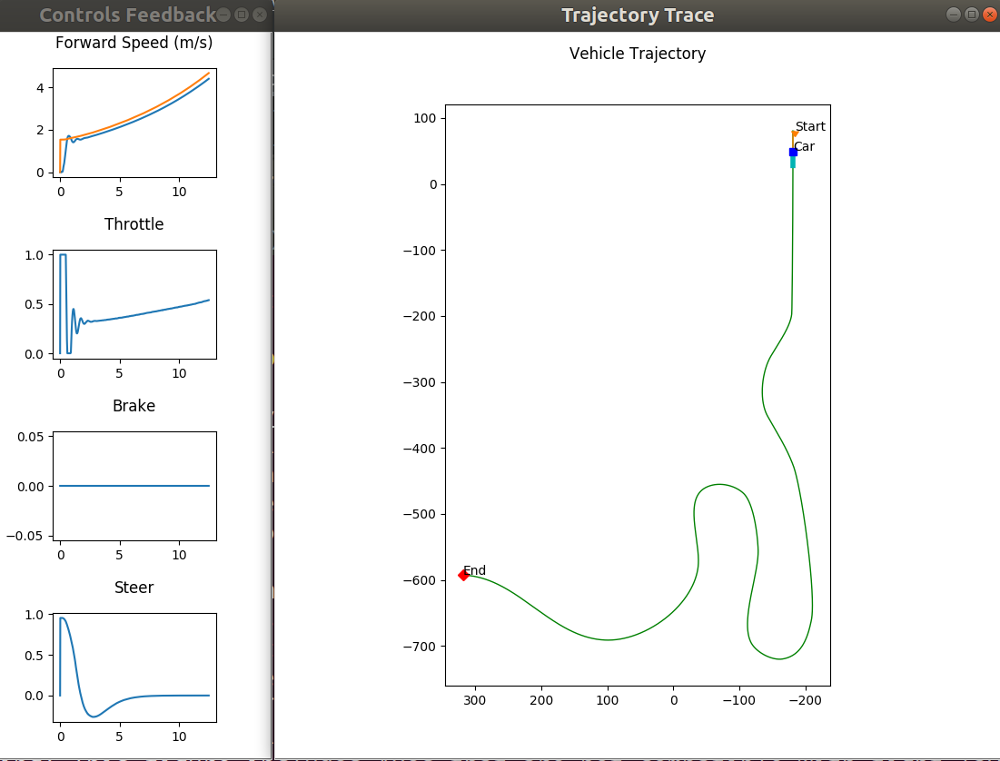
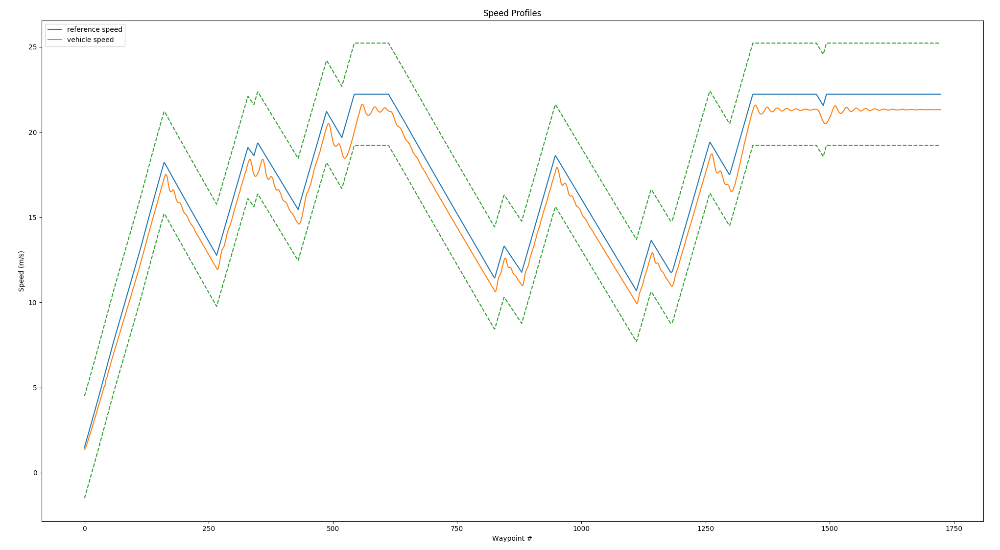
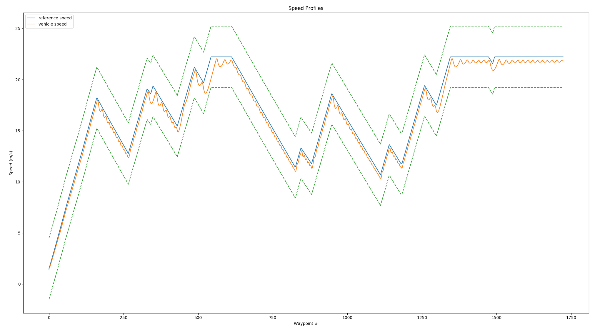

# 大作业结果

**(1) 作业要求**：[链接](https://www.coursera.org/learn/intro-self-driving-cars/programming/ac8R5/final-project-self-driving-vehicle-control)

根据本系列课程学习的内容，完成四轮车辆的Longitudinal和Lateral控制。在大作业的提供的代码中，主要对`controller2d.py`的代码进行了挖空，按照要求填上即可。

本次作业并没有过多的去研究更复杂的控制过程，只是简单的根据之前的学习内容对作业进行了完成。

对于Longitudinal控制，使用简单的P控制器，代码如下：

```python
			kp = 2
            a = kp * (v_desired - self._current_speed)
            throttle_output = a	
```

对于Lateral控制使用的是Pure pursuit控制器，代码如下：

```python
			k = 0.1
            LFC = 2
            dx = [self._current_x - waypoint[0] for waypoint in waypoints]
            dy = [self._current_y - waypoint[1] for waypoint in waypoints]
            d = [np.abs(np.sqrt(idx ** 2 + idy ** 2)) for (idx, idy) in zip(dx, dy)]
            index = d.index(min(d))
            L = 0
            LF = k * self._current_speed + LFC

            while LF > L and (index + 1) < len(waypoints):
                dx = waypoints[index + 1][0] - waypoints[index][0]
                dy = waypoints[index + 1][1] - waypoints[index][1]
                L += np.sqrt(dx ** 2 + dy ** 2)
                index += 1

            alpha = np.arctan2(waypoints[index][1] - self._current_y,
                               waypoints[index][0] - self._current_x) - self._current_yaw
            delta = np.arctan(2 * 3.0 * np.sin(alpha) / (k * (self._current_speed + 1e-5) + LFC))
            steer_output = delta
```

>  由于在前面的作业中，已经探索过了Stanley控制器和Pure Pursuit控制器的控制效果，所以这里并没有再对Stanley控制器进行实验。

TODO：在后续的内容中，对MPC控制器进行实现和实验对比。

**(2) Carla环境部署**

下载该课程提供的预编译版本的[Carla](https://d3c33hcgiwev3.cloudfront.net/3dXfty7_EemFOA6Hm29iNA_de05a1c02eff11e9821ed19f5bd73b7b_CarlaUE4Ubuntu.tar.gz?Expires=1646870400&Signature=AYbX2yD6RPgdPVEuSTLyU7tf7YtOYngfbHHEPmsq9iPzC6zJyB1R5bZ2QTjGBE7cmlFE3L5CNJD6d3zK-wSpsMh8284vEYqbVLS0Oace7f7uBth-m06-G9FQ2YIezR6j~-dzrErbJurGyeaK9bixnKhdHTL4mqI-bcUM03cF4nw_&Key-Pair-Id=APKAJLTNE6QMUY6HBC5A)，然后按照文档[CARLA-Setup-Guide-Ubuntu](./CARLA-Setup-Guide-_Ubuntu.pdf)中要求解压和配置环境，该过程比较简单，没啥大坑，但是注意Python要使用3.6，最好使用conda构建一个虚拟环境。

> 注意，在Carla的文件包中提供了一个`requirements.txt`库版本要求，其中`matplotlib`版本应该使用`3.0.1`。不然在后面的作业中会报错。

最后将大作业的代码，拷贝到`CarlaSimulator/PythonClient`下。

**(3) 运行**

首先，运行Carla环境：

```shell
cd CarlaSimulator/
./CarlaUE4.sh /Game/Maps/RaceTrack -carla-server -benchmark -fps=30 -quality-level=Epic
```

然后，运行作业代码：

```shell
cd CarlaSimulator/PythonClient/final_project_code
python3 module_7.py
```

将会看到Carla中的车辆动起来了，并且会生成窗口显示运行的速度和轨迹。如下图：




**(4) 实验结果**

**P Controller结果**



> 在只用P控制器的时候，可以发现速度满足课程中的误差要求，但是总是滞后于参考速度，与参考速度有一定的差距始终不能消除。说明要想追求更好的跟踪效果，只使用一个简单的P控制器是不够的。



> 当系统增加前馈控制之后，速度滞后的问题得到了一定程度的解决，但是速度震荡的问题加剧。猜测如果再加入PID中的I和D控制，情况会得到好转。

**(4) 实验结果评估**

对于速度控制的结果，课程中提供了一个Python程序进行结果评估，使用方法如下：

```shell
cd PythonClient/final_project_code
python evaluate_result.py racetrack_waypoints.txt controller_output/trajectory.txt
```

作业中代码生成的结果如下：

> Assessment passed!, 100.00% of waypoints completed.
