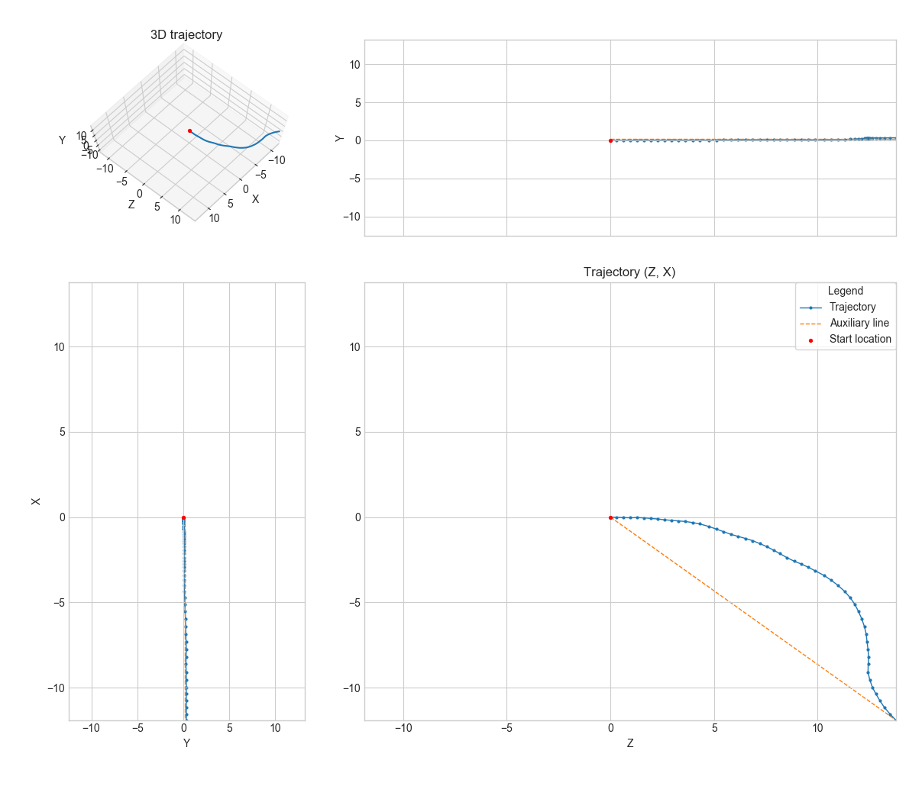

# 总结

## 1.课程内容总计

这一讲对于SLAM出身的我来说，基本都是比较基础的内容。在知识点的理解上没有什么问题，但是为了加深对python的应用，以及opencv-python的应用，所以还是按照课程的内容和作业做了一遍。

## 2. 作业结果

首先需要下载课程中提供的数据集，然后解压将`data`文件夹放在`visual_perception_self_driving_cars/week_2_image_features_detectors/code`文件夹下，即可完成数据准备工作。

然后运行如下程序，即可看到运行结果：

```python
python3 practice_assignment.py
```

**实验结果**

